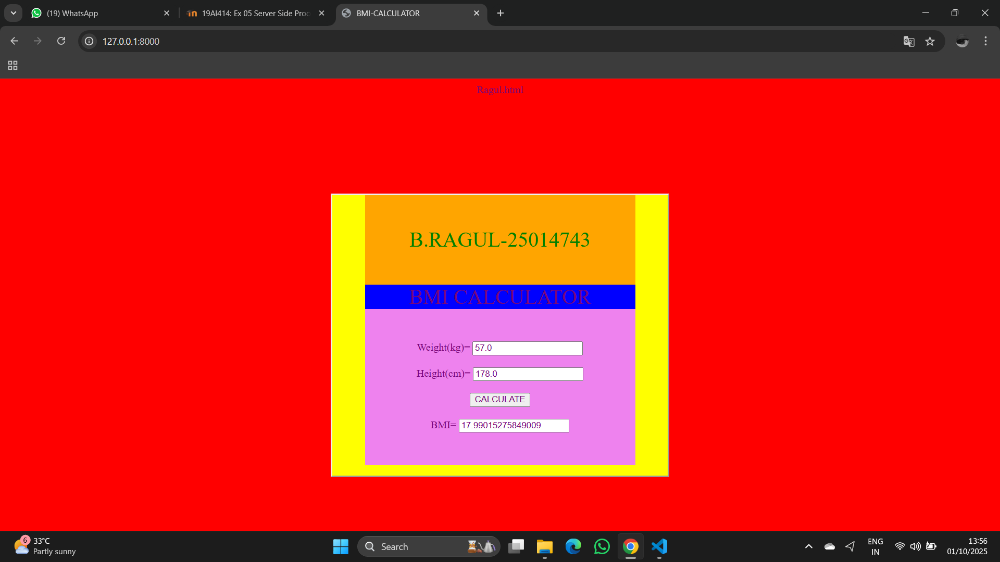

# Ex.05 Design a Website for Server Side Processing
## Date:01/10/2025

## AIM:
To design a website to calculate the Body Mass Index (BMI) in the server side.

## FORMULA:
BMI = W/H<sup>2</sup>
<br> BMI --> Body Mass Index
<br> W --> Weight
<br> H --> Height

## DESIGN STEPS:

### Step 1:
Clone the repository from GitHub.

### Step 2:
Create Django Admin project.

### Step 3:
Create a New App under the Django Admin project.

### Step 4:
Create python programs for views and urls to perform server side processing.

### Step 5:
Create a HTML file to implement form based input and output.

### Step 6:
Publish the website in the given URL.

## PROGRAM :
```
ww.html
<html>
    <head>
        
        <title>BMI-CALCULATOR</title>
        <style>
        body{
          background-color: red;
          border-top: 10;
        }
        .m{
          background-color: yellow;
          border-style: outset;
          margin-top: 150px;
          margin-left: 500px;
          margin-right: 500px;
          
        }
        *{
          color: rgb(122, 6, 122);
        }
            .main{
                font-size: 200%;
                text-align: center;
                text-decoration: upper;

                background-color: orange;
                 margin-left: 50px;
                  margin-right: 50px;
                  padding: 50px;
                  
                  
            }
            .a{
                font-size: 200%;
                text-align: center;
                background-color: blue;
                 margin-left: 50px;
                  margin-right: 50px;
                
                 
            }
            form{
              text-align: center;
              background-color: violet;
               margin-left: 50px;
             margin-right: 50px;
             padding: 50px;
            }
           
        </style>
    </head>
    <body>

       <div class="m">
        <div class="main" style="color: green">B.RAGUL-25014743</div>
        <div class="a">
        BMI CALCULATOR </div>
        <form method="post">
          
           
           
            <label>Weight(kg)=</label>
            <input type="text" name="weight" value="{{w}}"><br><br>
             <label>Height(cm)=</label>
            <input type="text" name="height" value="{{h}}"><br><br>
            <button type="submit">CALCULATE</button><br><br>
            <label>BMI=</label>
            <input type="text" name="bmi" value="{{bmi}}">
        </div>
        </form>
        
        
    </body>
</html>

views.py

from django.shortcuts import render
def calculate_bmi(request):
    context={}
    context['bmi']="0"
    context['w']="0"
    context['h']="0"
    if(request.method=='POST'):
       w= float(request.POST.get('weight','0'))
       h=float(request.POST.get('height','0'))
       print('request=',request)
       
       print('Weight=',w)
       print('Height=',h)
       bmi=w/((h/100)**2)
       context['bmi']=bmi
       context['w']=w
       context['h']=h
       print('BMI=',bmi)
    return render(request,'myapp/ww.html',context)

# Create your views here.

urls.py

from django.contrib import admin
from django.urls import path
from myapp import views

urlpatterns = [
    path('admin/', admin.site.urls),
    path('bmi/',views.calculate_bmi,name="bmi"),
    path('',views.calculate_bmi,name="bmicalculator")
]

```


## SERVER SIDE PROCESSING:
.png>)

## HOMEPAGE:



## RESULT:
The program for performing server side processing is completed successfully.
